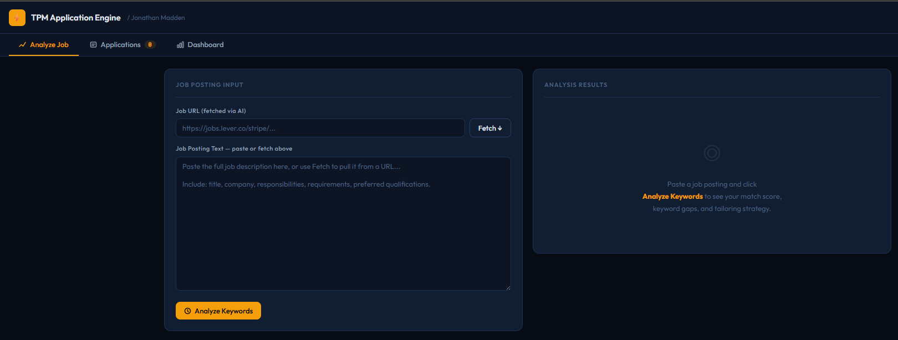

# Make Me! Application Engine

**Make Me! Application Engine** is an AI-powered workflow system designed to solve a specific problem: most job applicants are filtered out before a human ever sees their resume.

Part of the **Make Me!** career tools suite — built by a Senior Technical Program Manager to solve real job search problems with real AI integration.

No installation. No backend. No friction.



---

## What This Demonstrates

- Translating a real-world problem into a working end-to-end system
- Designing workflow logic, not just isolated features
- Applying AI in a practical, outcome-driven way
- Making deliberate architectural tradeoffs under constraints
- Prompt engineering for structured JSON analysis and semantic HTML output

---

## The Problem

During an active job search, low interview conversion rates were traced to a specific root cause: resumes were not being tailored to individual job postings, and ATS systems were filtering them out before human review.

Manual tailoring:
- Takes too long
- Is inconsistent across applications
- Does not scale across an active pipeline

Additional gaps:
- No visibility into application status across concurrent opportunities
- Cover letters were generic or took too long to personalize
- No feedback loop between keyword strategy and application outcomes

---

## The Solution

A self-contained system that:
- Analyzes any job posting against a base resume
- Surfaces keyword and positioning gaps with a match score
- Generates tailored resumes and cover letters on demand
- Tracks application progress across pipeline stages
- Visualizes pipeline conversion through a live dashboard

All within a single browser tab.

---

## Design Constraints (Intentional)

- **Single HTML file** — zero dependencies, zero deployment surface, runs in any browser
- **Runtime API key input** — key entered by user at runtime, never stored or persisted
- **No backend or database** — fully client-side execution by design
- **localStorage persistence** — simple, private, session-durable state management

These were deliberate decisions to maximize portability, speed of use, and ease of adoption. See Known Limitations for the production tradeoffs this implies.

---

## Features

### Analyze Job
- Paste or fetch any job posting URL
- Claude extracts keywords, required skills, and role signals
- Compares against your base resume and returns a **match score**
- Surfaces keywords present, keywords missing, and a tailoring strategy

### Resume Tailoring
- Generates a keyword-optimized resume tailored to the specific posting
- Exactly 4 Core Competency categories in bold-label format
- Exactly 4 bullets per role — tight, outcome-focused, under 20 words each
- No fabricated certifications or credentials — only what's in your base resume
- Downloads as a `.doc` file ready to submit

### Cover Letter Generation
- Writes a role-specific cover letter using job context and candidate strengths
- Structured narrative: hook → achievement alignment → company context → CTA
- Downloads as a `.doc` file

### Application Pipeline Tracker
- Log applications directly from the analysis view
- Track status across: Applied → No Response → Response → Interview → Offer
- Full table view with editable stage dropdowns

### Dashboard
- Visual application funnel showing conversion at each stage
- Bar chart of pipeline distribution
- Response rate and offer metrics

---

## Architecture

```
┌──────────────────────────────────────────────────┐
│              Browser (Single HTML File)           │
│                                                  │
│  ┌──────────────┐    ┌──────────────────────┐   │
│  │  Job Posting  │    │    Base Resume        │   │
│  │  (paste/fetch)│    │    (RESUME constant)  │   │
│  └──────┬───────┘    └──────────┬────────────┘   │
│         │                       │                 │
│         └──────────┬────────────┘                 │
│                    ▼                              │
│          ┌─────────────────┐                     │
│          │  Prompt Engine   │                     │
│          │  (task routing)  │                     │
│          └────────┬────────┘                     │
│                   │                               │
│  ┌────────────────┴──────────────────────────┐   │
│  │  localStorage — Application State          │   │
│  └───────────────────────────────────────────┘   │
└──────────────────────┬───────────────────────────┘
                       │ HTTPS
                       ▼
              ┌─────────────────┐
              │  Anthropic API   │
              │  claude-sonnet   │
              └─────────────────┘
```

**Prompt engineering approach:**
Each task uses a dedicated prompt with explicit output format instructions — raw JSON for analysis, semantic HTML for document generation. Prompts enforce strict output rules: exact competency format, bullet count limits, and no fabrication of credentials. The web search tool is used for URL-based job post fetching.

---

## Setup

1. Clone or download this repo
2. Open `Application_Engine.html` in any modern browser — Chrome recommended
3. Get an [Anthropic API key](https://console.anthropic.com/)
4. Paste your API key in the header field — the dot turns green when valid
5. Paste your base resume into the `RESUME` constant near line 360
6. Paste a job posting and run the analysis

**No installation. No build step. No server.**

---

## How to Add Your Resume

Open the HTML file in a text editor and find the `RESUME` constant near line 360:

```javascript
const RESUME = `YOUR NAME
Your Title | Your Location | your@email.com
...`;
```

Replace the placeholder with your resume content in plain text. Save. Done.

---

## Known Limitations

- **Client-side API calls** — API requests are made directly from the browser. Deliberate prototype decision. In production, calls would be proxied through a backend service.
- **Static resume input** — the base resume is defined in the script as a constant. A production version would support dynamic upload or profile editing.
- **Output parsing** — JSON extraction uses first/last brace matching, reliable with well-structured model output but would benefit from schema validation in production.
- **Single-file architecture** — intentional for portability, but a production system would separate concerns into modules.

---

## Tech Stack

- **Vanilla HTML / CSS / JS** — single file, no framework
- **Anthropic Claude API** — `claude-sonnet-4-20250514` via `/v1/messages`
- **Chart.js** — pipeline visualization (loaded via CDN)
- **No backend. No database. No build tooling.**

---

## Roadmap

**Phase 2 — Email Integration**
Connect to Gmail/Outlook API to monitor for application status signals and auto-update pipeline stage based on recruiter or ATS response emails.

**Phase 3 — Outcome Feedback Loop**
Tag applications with final outcomes and analyze which keyword strategies correlated with higher screen rates. Feed outcome data back into tailoring prompts.

**Phase 4 — Persistence Layer**
Replace localStorage with IndexedDB or a lightweight backend for cross-session history and CSV export.

---

## Part of the Make Me! Suite

| Engine | Tool | Purpose |
|--------|------|---------|
| Engine 1 | **[Make Me! Resume Positioning Engine](https://github.com/Jon-P-Madden/resume-positioning-engine)** | Build a strategically positioned resume from scratch |
| Engine 2 | **Make Me! Application Engine** | Analyze job postings, tailor existing resumes, track applications |

Use Engine 1 to build your positioning. Use Engine 2 to apply it.

---

## Why This Exists

This project is not about building a resume generator.

It demonstrates how a builder approaches a real problem:
- **Problem diagnosis** — low conversion traced to a specific, fixable cause
- **Workflow design** — end-to-end system, not a one-off script
- **Constraint-driven architecture** — deliberate tradeoffs, not accidental limitations
- **Applied AI** — Claude API used as an integration layer, not a novelty

---

## License

MIT — use it, fork it, adapt it.

---

*Built by Jonathan Madden*
*[LinkedIn](https://linkedin.com/in/jonathan-p-madden) · [github.com/Jon-P-Madden](https://github.com/Jon-P-Madden)*
